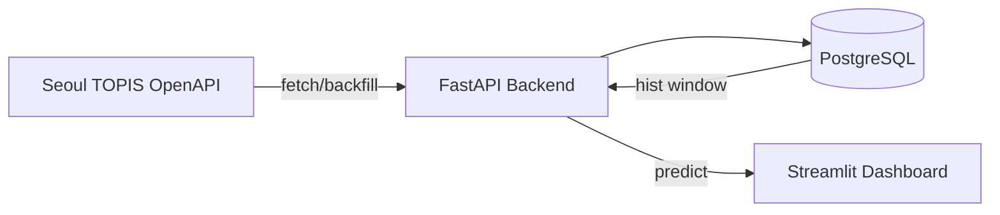
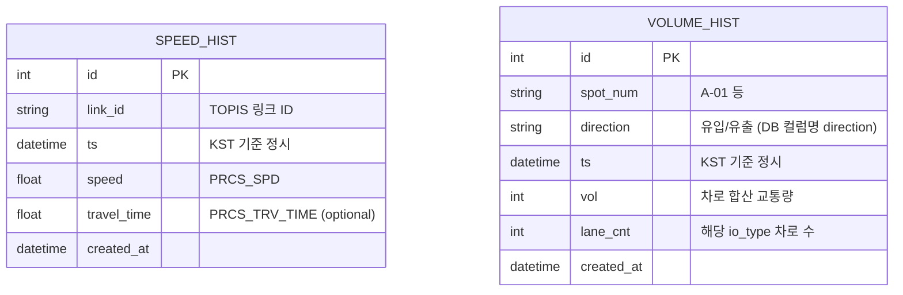

# MetroVision AI · 스마트시티 교통 예측 플랫폼 (FastAPI + PyTorch + Streamlit)

서울시 TOPIS(OpenAPI) 기반의 **링크 단위 속도(speed)** 및 **지점 단위 교통량(volume)** 시계열을 수집·저장하고, 학습된 **Seq2Seq + GCN + LSTM(PyTorch)** 모델로 **향후 N시간 예측**을 제공하는 웹 서비스입니다.

* **Backend**: FastAPI + SQLAlchemy + PostgreSQL
* **ML Inference**: PyTorch 체크포인트(`.pt`) 기반 실시간 추론
* **Frontend**: Streamlit + Plotly 대시보드
* **Run**: Docker Compose로 DB/API/UI 원클릭 구동

### **!TOPIS(OpenAPI) key 발급!**

**https://topis.seoul.go.kr/refRoom/openRefRoom_4.do**

---

## 0) Demo

* **UI**: `http://localhost:8501`
* **API**: `http://localhost:8000`
* **Swagger**: `http://localhost:8000/docs`

📸 Screenshots (optional)

* UI 메인 화면:


---

* road_index 그래프:


---

* 링크별 speed 그래프:


---

* 지점별 volume 그래프:


---

## 1) Architecture

### 1.1 전체 구조



### 1.2 핵심 처리 흐름

1. **(관리) 데이터 적재**

   * TOPIS에서 실시간/과거 데이터를 호출
   * `speed_hist`, `volume_hist`에 시간당 1개 단위로 저장(Upsert)
2. **(서비스) 예측**

   * DB에서 최근 `T+24` 구간 히스토리 조회
   * 시간축 정규화(resample 1h) + 결측 보정(interpolate)
   * 피처 생성 + 표준화(StandardScaler)
   * 모델 추론 → 역변환 → 지표(congestion/load/combined) 계산
3. **대시보드 제공**

   * road_index / 링크별 예측 / 지점별 유입·유출 예측 시각화

---

## 2) Project Structure

```bash
metrovision/
  app/                      # FastAPI backend
    main.py                 # 엔드포인트/라우팅
    services.py             # TOPIS 호출 + DB upsert + 예측 로직
    schemas.py              # 요청/응답 Pydantic 스키마
    models_db.py            # SQLAlchemy ORM (speed_hist, volume_hist)
    ml_models.py            # Seq2Seq GCN LSTM 정의
    config.py               # 환경변수/경로/DB 설정
    db.py                   # DB 세션/엔진
  ui/
    streamlit_app.py        # Streamlit 대시보드
    Dockerfile
    ui_requirements.txt
  data/
    roads.geojson           # (선택) 도로 라인 시각화용
  models/
    speed_seq2seq_gcn_lstm_scaled.pt
    volume_seq2seq_gcn_lstm_scaled.pt
  Dockerfile                # backend image
  docker-compose.yml        # db + api + ui
  requirements.txt          # backend deps
  .env                      # 환경변수(TOPIS_API_KEY 등)
```

---

## 3) Tech Stack & Versions

### Python

* **Python 3.11**

  * Docker 이미지: `python:3.11-slim`

### Backend 주요 라이브러리

* `fastapi`, `uvicorn[standard]`: API 서버
* `sqlalchemy(2.x)`, `psycopg2-binary`: PostgreSQL ORM / Driver
* `httpx`: TOPIS 비동기 호출
* `pydantic(2.x)`, `pydantic-settings`: 설정/스키마 검증
* `numpy`, `pandas`: 시계열 처리/피처링
* `scikit-learn`: `StandardScaler`(학습 스케일러 상태 로드)
* `torch`: 모델 로드/추론

### Frontend(UI) 주요 라이브러리

* `streamlit`, `plotly`, `requests`, `pandas`

> 실제 범위는 `requirements.txt`, `ui/ui_requirements.txt` 참고.

---

## 4) Environment Variables (.env)

루트에 `.env` 파일 생성:

```env
TOPIS_API_KEY=YOUR_TOPIS_KEY

# 선택(기본값은 docker-compose 내부 주소)
DATABASE_URL=postgresql+psycopg2://metro:metro@db:5432/metrovision
```

* `TOPIS_API_KEY`가 없으면 TOPIS 기반 적재/백필 기능이 동작하지 않습니다.
* 대신 seed dummy로 speed 예측 테스트는 가능합니다.

---

## 5) Run (Docker Compose)

### 5.1 실행

```bash
docker compose up --build
```

### 5.2 접속

* API: `http://localhost:8000`
* Swagger: `http://localhost:8000/docs`
* UI: `http://localhost:8501`
* PostgreSQL(로컬): `localhost:5433` (컨테이너 내부 5432)

---

## 6) Run (Local, without Docker) — 선택

### 6.1 Backend

```bash
python -m venv .venv
source .venv/bin/activate   # windows면 .venv\Scripts\activate

pip install -r requirements.txt
export TOPIS_API_KEY=...
export DATABASE_URL=postgresql+psycopg2://...

uvicorn app.main:app --host 0.0.0.0 --port 8000
```

### 6.2 UI

```bash
pip install -r ui/ui_requirements.txt
export API_BASE=http://localhost:8000

streamlit run ui/streamlit_app.py --server.port 8501
```

---

## 7) Database Schema (ERD)

### 7.1 테이블 요약

* `speed_hist`: 링크별 시간당 속도/통행시간 저장
* `volume_hist`: 지점별 유입/유출 방향 시간당 교통량 저장



### 7.2 유니크 제약

* `speed_hist`: `(link_id, ts)` 유니크
* `volume_hist`: `(spot_num, direction, ts)` 유니크

> 코드상 파이썬 속성은 `io_direction`이지만, DB 컬럼명은 `direction`입니다.

---

## 8) Data Source (TOPIS OpenAPI)

### 8.1 Speed: TrafficInfo

* 링크 ID 기준 현재 속도/통행시간을 조회하여 `speed_hist`에 저장

### 8.2 Volume: VolInfo

* `spot_num + ymd + hh`로 조회
* 응답 row를 `io_type=1(유입) / 2(유출)`로 그룹핑
* lane별 `vol`을 합산하여 `volume_hist`에 저장

> 본 프로젝트는 **VolInfo를 “1회 호출”**하고, 응답에서 `io_type`을 분리·정규화해 저장합니다.

---

## 9) Preprocessing / Feature Engineering

### 9.1 시간 정규화 (공통)

* ts를 KST로 변환 (tz-aware 처리)
* `resample("1h").mean()` 으로 시간당 1개 정규화
* 결측은 `interpolate(time)` + `ffill/bfill`

### 9.2 Dynamic Features (speed/volume 공통)

최근 `T` 구간에서 아래 피처를 생성:

* 원값: `speed` 또는 `vol`
* 시간: `hour`, `day_of_week`, `is_weekend`, `sin_hour`, `cos_hour`
* lag: `lag_1h`, `lag_24h`
* rolling: `roll_mean_3h`, `roll_std_3h`, `roll_mean_6h`, `roll_std_6h`

> 최소 히스토리 요구: **`T + 24`시간 이상** (lag_24h 때문)

### 9.3 Static Features

* Speed: `distance`, `lanes`, `free_flow_speed`
* Volume: `spot_mean_vol`, `spot_max_vol`

### 9.4 Scaling

* 학습 시 저장된 `StandardScaler` 상태를 ckpt에서 로드해 동일하게 적용
* 모델 출력은 `target_mean/target_std`로 역변환

---

## 10) Model (Seq2Seq + GCN + LSTM)

* 그래프 임베딩: `X0`, `A_hat` 기반 GCN
* 인코더: (dynamic feature + node embedding) → LSTM
* 디코더: autoregressive LSTM + FC로 horizon만큼 예측

체크포인트(`.pt`)에는 다음이 포함됩니다:

* `model_state_dict`
* `config` (T/H/dim 등)
* `X0`, `A_hat`
* 스케일러 상태(`scaler_dynamic_state`, `scaler_static_state`)
* id 매핑(`link_id_to_idx`, `spot_id_to_idx`)
* 메타(`speed_meta`, `vol_meta`)

---

## 11) API Documentation (Swagger)

* Swagger UI: `http://localhost:8000/docs`
* OpenAPI JSON: `http://localhost:8000/openapi.json`

---

## 12) API Endpoints (정리)

### 12.1 Meta

* `GET /api/roads`

  * 도로 목록 + speed/volume 가능 여부
* `GET /api/roads/{road_name}/links`

  * 도로에 속한 링크 목록(meta 포함)
* `GET /api/roads/{road_name}/spots`

  * 도로에 속한 volume 지점(유입/유출 포함)

### 12.2 Admin (적재/백필/더미)

* `POST /api/admin/fetch-speed`
* `POST /api/admin/fetch-volume`
* `POST /api/admin/seed-speed-dummy`
* `POST /api/admin/backfill-volume`
* `POST /api/admin/seed-road-speed-dummy`
* `POST /api/admin/backfill-road-volume`

### 12.3 Predict

* `POST /api/predict/segment`

  * 특정 링크(+옵션 spot) 예측
* `POST /api/predict/road`

  * 도로 단위 예측(링크 평균 + 지점 평균) 및 road_index 제공

---

## 13) Example Requests / Responses

### 13.1 Road Predict 요청 예시

```bash
curl -X POST http://localhost:8000/api/predict/road \
  -H "Content-Type: application/json" \
  -d '{
    "road_name":"올림픽대로",
    "horizon":6,
    "include_volume":true,
    "io_directions":["유입","유출"]
  }'
```

### 13.2 Road Predict 응답 예시 (일부)

```json
{
  "road_name": "올림픽대로",
  "anchor_ts": "2025-12-15T10:00:00+09:00",
  "horizon": 6,
  "road_index": [
    {
      "offset_h": 1,
      "timestamp": "2025-12-15T11:00:00+09:00",
      "speed_index": 0.31,
      "volume_index": 0.52,
      "combined_index": 0.415
    }
  ],
  "missing_speed_links": [],
  "missing_volume_spots": []
}
```

### 13.3 Segment Predict 요청 예시

```bash
curl -X POST http://localhost:8000/api/predict/segment \
  -H "Content-Type: application/json" \
  -d '{
    "link_id":"123456",
    "spot_num":"A-01",
    "io_direction":"유입",
    "horizon":6
  }'
```

### 13.4 Road Volume Backfill 요청 예시

```bash
curl -X 'POST' \
  'http://localhost:8000/api/admin/backfill-road-volume' \
  -H 'accept: application/json' \
  -H 'Content-Type: application/json' \
  -d '{
  "road_name": "동일로",
  "hours": 72,
  "end_ts": "2025-12-14T20:54:33.730Z"
}'
```

### 13.5 Road Volume Backfill 응답 예시

```json
{
  "road_name": "동일로",
  "hours": 72,
  "start_ts_kst": "2025-12-12T06:00:00+09:00",
  "end_ts_kst": "2025-12-15T05:00:00+09:00",
  "io_directions": [
    "유입",
    "유출"
  ],
  "spots": [
    "B-02",
    "D-07",
    "D-13"
  ],
  "inserted": 424,
  "skipped": 6,
  "error_count": 1,
  "errors": [
    {
      "ts": "2025-12-14T06:00:00+09:00",
      "spot_num": "B-02",
      "error": "Server disconnected without sending a response."
    }
  ]
}
```

---

## 14) Dashboard (Streamlit)

UI 기능 요약:

* 도로 검색/필터(교통량 포함 여부)
* road_index(speed/volume/combined) 시각화
* 링크별 speed / congestion_index 시각화
* 지점별 유입/유출 volume / load_index 시각화
* 누락 데이터(missing links/spots) 표시

---

## 15) Training Pipeline (학습) — 가이드/재현 문서

> ⚠️ 현재 레포에는 “서빙/추론 코드”가 중심이며,
> 학습 코드는 **Colab 노트북 또는 별도 스크립트**로 관리하는 것을 권장합니다.

### 15.1 학습 데이터 준비 (예시 권장 흐름)

1. TOPIS로 과거 `N일` 백필(backfill) 수행

   * speed: 반복 fetch(또는 별도 수집 스크립트)
   * volume: `/api/admin/backfill-volume`, `/api/admin/backfill-road-volume`
2. DB에서 학습용 데이터 export (예: parquet/csv)
3. 그래프 구성

   * 노드: link/spot
   * `A_hat`: 인접행렬 정규화
   * `X0`: 정적 feature matrix
4. 학습

   * Speed 모델: link_id 예측
   * Volume 모델: spot_num + io_direction 예측
5. 체크포인트 저장

   * config / scalers / meta / mapping / X0 / A_hat 포함

### 15.2 학습 코드/노트북 링크

* Colab (Speed Training): **[TODO: 링크 추가]**
* Colab (Volume Training): **[TODO: 링크 추가]**
* 학습 데이터 샘플(parquet): **[TODO: 링크/경로]**

> 체크포인트 구조가 `services.py`의 로딩 로직과 일치해야 합니다.
> (`speed_meta`, `vol_meta`, `X0`, `A_hat`, scaler state 등)

---

## 16) Troubleshooting

### 16.1 “히스토리 부족” 오류

* 예측은 최소 `T+24`시간 이상 히스토리가 필요합니다.
* 해결:

  * 더미 삽입: `/api/admin/seed-speed-dummy` 또는 `/api/admin/seed-road-speed-dummy`
  * TOPIS 백필: `/api/admin/backfill-road-volum` 등

### 16.2 TOPIS 호출 실패

* `.env`의 `TOPIS_API_KEY` 확인
* TOPIS 응답이 비어있는 시간대/지점일 수 있음(스킵 처리됨)

### 16.3 Docker Postgres 포트 충돌

* 로컬에서 5432 사용 중이면 충돌 가능
* 본 프로젝트는 `5433:5432`로 노출합니다. 필요 시 compose에서 수정하세요.

### 16.4 음수 예측값

* UI에서 speed 예측이 음수면 경고를 표시합니다.
* 원인 후보:

  * 역스케일 처리/클리핑 정책 부재
  * 모델 학습 데이터 분포/정규화 불일치
* 대응:

  * 서빙 단계에서 `np.clip(y_hat, 0, ff*1.2)` 같은 정책을 둘지 결정(정책성)

---

## 17) Roadmap (Optional)

* [ ] 학습 코드/노트북을 `training/` 디렉토리로 정리
* [ ] GeoJSON 기반 지도 시각화(도로 라인에 road_index overlay)
* [ ] 캐시/배치 적재 작업 자동화(Cron/Celery 등)
* [ ] CI/CD (GitHub Actions): compose build & lint & test
* [ ] API 인증(관리용 엔드포인트 보호)

---

## 18) License / Attribution

* Data Source: **Seoul TOPIS OpenAPI**
* 본 레포는 연구/학습 목적의 예측 서비스 구현 예시를 포함합니다.

